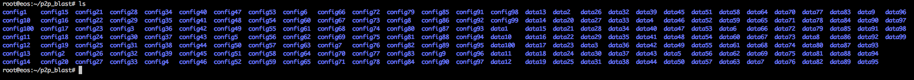
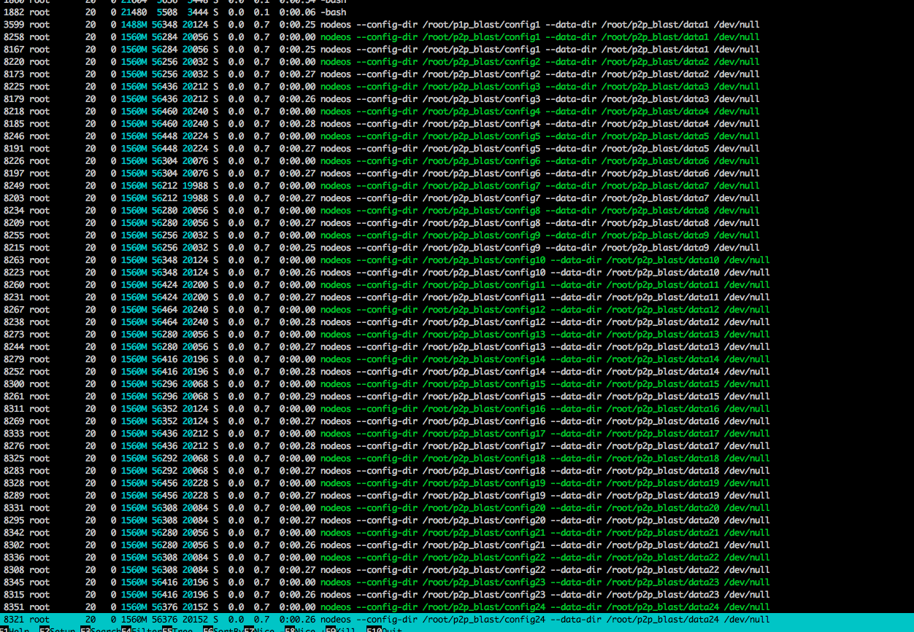
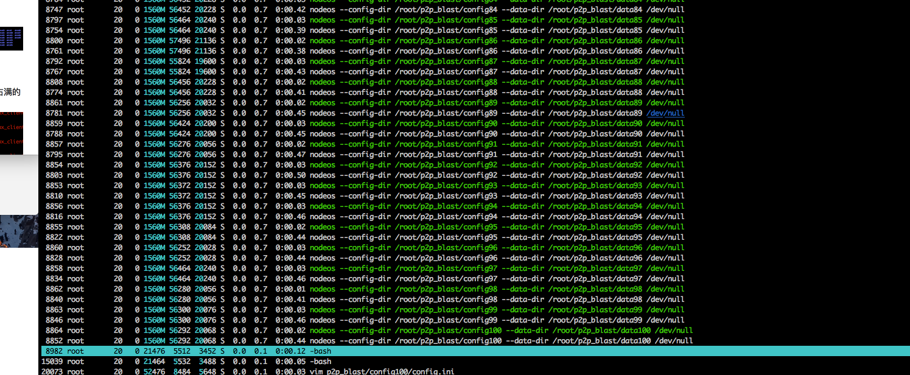
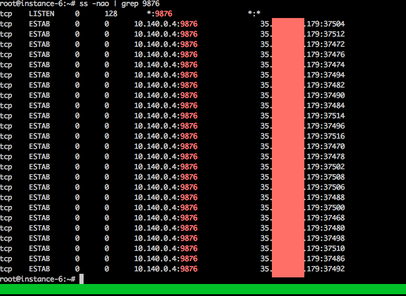
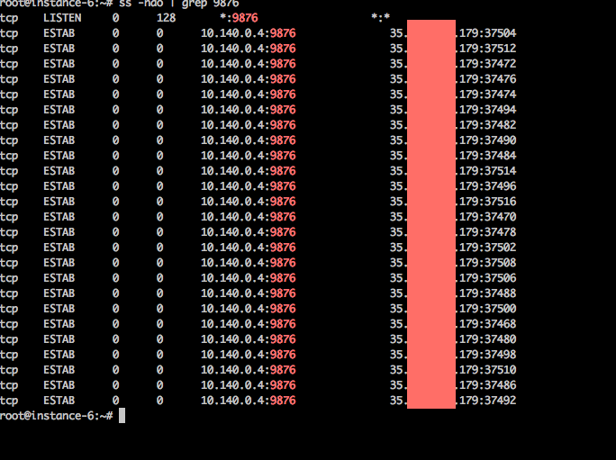
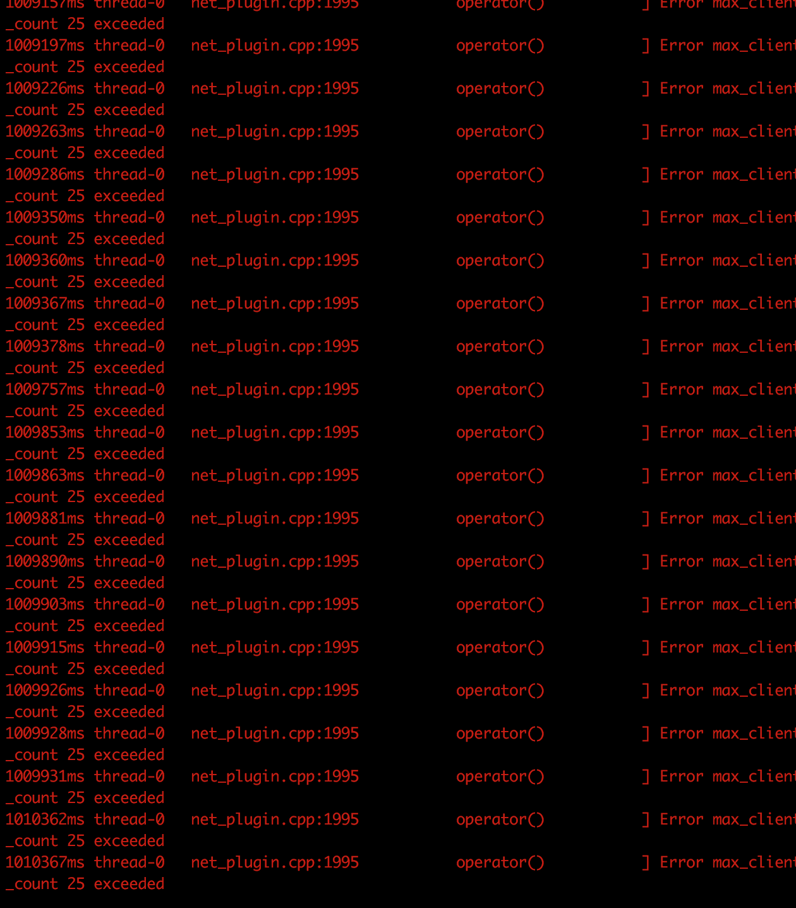

# P2P巫节点

## 漏洞简介

该漏洞属于 P2P 服务安全设计未完善所导致的阻塞攻击，可以非常小的攻击成本达到瘫痪主节点的目的。

## 攻击原理

根据官方配置文件中的描述，P2P 服务默认最大连接数为 25。
	
	# Maximum number of clients from which connections are accepted, use 0 for no limit
	max-clients = 25

攻击机通过脚本启动极多个 nodeos 节点。每个 nodeos 节点的 p2p-peer-address 配置项，都配置相同的目标机。一台机器模拟了几百个机器连接的情况，同时向节点服务器发起连接请求，由于 P2P 服务没有对单 IP 连接数进行限制，恶意节点可非常轻松的占满节点服务的 25 个连接数，并保持不断开。

## 实现

在攻击机创建的 100 个恶意节点

100 个 nodeos 节点运行情况

一个 nodeos 节点可以配置多个 p2p-peer-address。也就是可以同时霸占多个 nodeos。造成正常的数据无法及时或者无法处理的情况

目标机器的 9876 端口连接情况,一旦连接上，并没有超时之类的机制：

1. 初始攻击时的状态截图：
	
2. 开始攻击后两小时的状态截图
	

由于连接被占满，其他连接会依旧尝试连接，目标机器连接数被占满的时的日志

通过 MOOZ(独有的全网探测引擎)发现目前全球网络空间中已有 1062450 台设备开放 9876 端口。以此为对比，主网上线后再次探测可以快速定位节点信息。

## 缓解方案
1. 建议官方在 P2P 模块中添加对单 IP 节点连接数量的控制。
2. 在系统层面上对网络连接情况进行监控，一旦发现某个IP连接异常就调用脚本配置 iptables 规则屏蔽异常的 IP。

